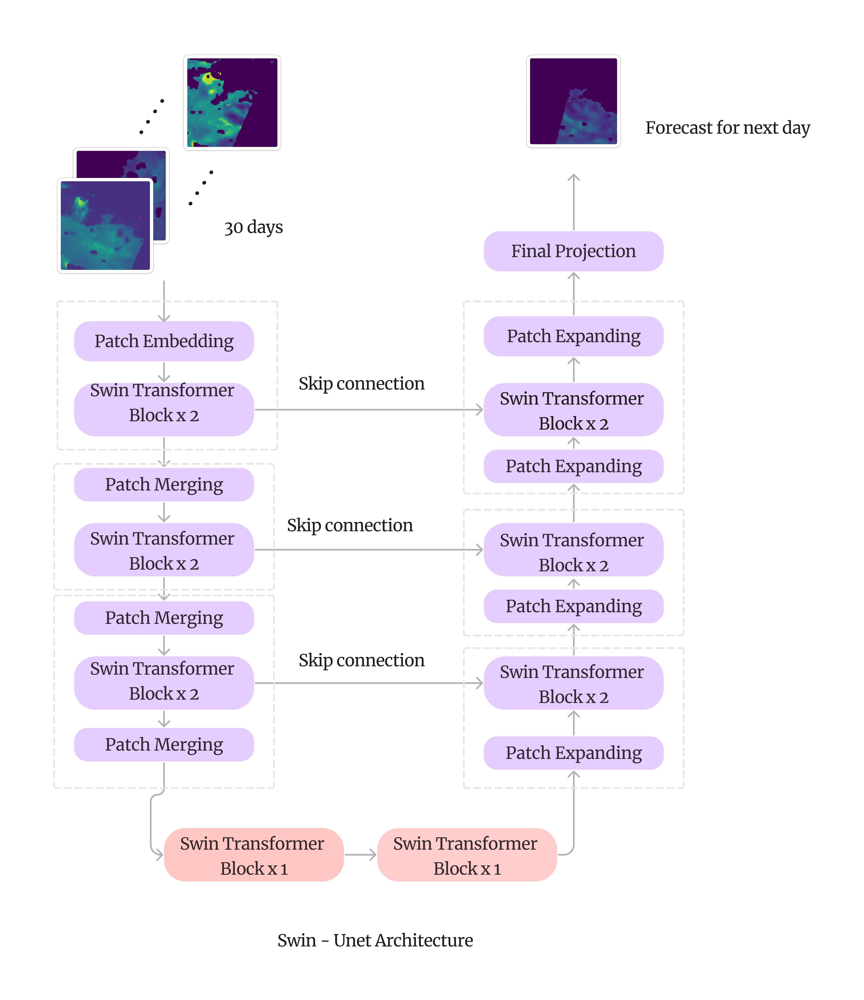
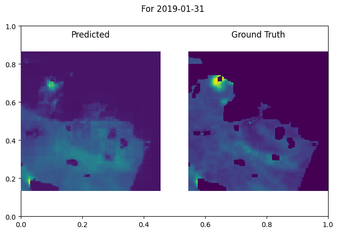
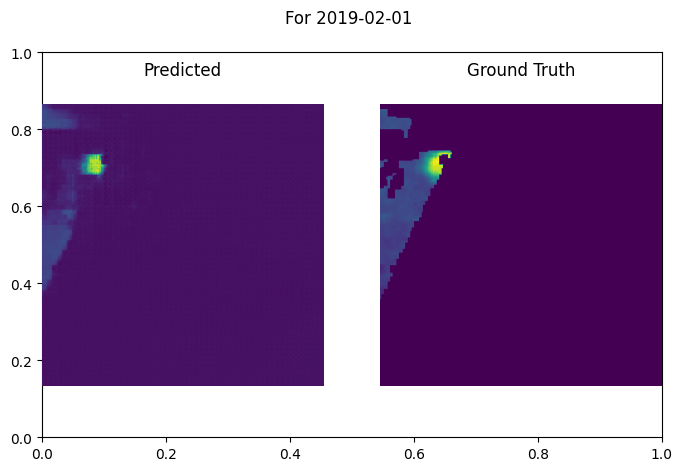

# Forecasting with Swin-Unet on Satellite Meteorological Images

## Model Architecture


## Installation
To use this forecasting model, install CUDA and PyTorch. 

Additionally, install the required Python packages by running:

```bash
pip install -r requirements.txt
```

## Dataset
Download the datasets and organize them under the `Dataset` directory. Place each dataset under `train`, `valid`, and `test` directories accordingly.

## Training
To train the forecasting model, run the following command:
```bash
python training.py
```

## Inference
To perform inference using the trained model, run the following command:
```bash
python inference.py
```

## Result

